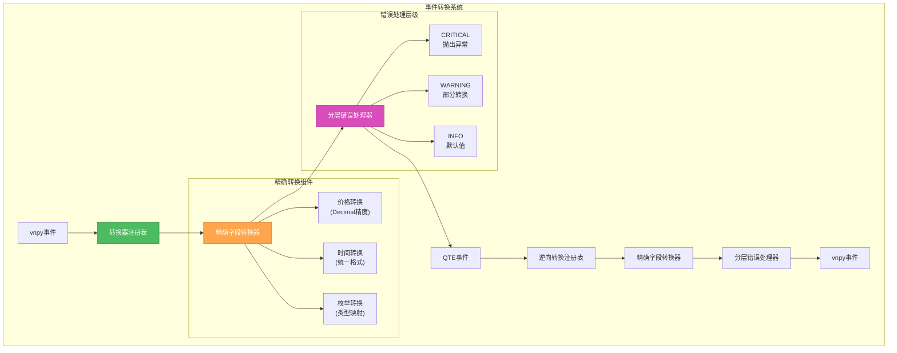

# 🎨🎨🎨 ENTERING CREATIVE PHASE: 事件转换机制设计

**组件**: QTE到vnpy事件转换机制  
**复杂度**: Level 3 (数据映射策略)  
**状态**: 🎨 Creative Phase进行中  
**目标**: 设计高效准确的事件转换系统

## 📋 组件描述与要求

### 核心功能要求
QTE与vnpy之间需要建立完整的事件转换机制：
- **双向转换**: vnpy请求→QTE命令，QTE事件→vnpy事件
- **数据准确性**: 保证转换过程中数据完整性和精度
- **类型安全**: 强类型检查，避免运行时错误
- **性能优化**: 高频数据转换延迟最小化
- **错误处理**: 完善的异常处理和错误传播

### 事件类型映射
```markdown
vnpy → QTE 方向:
├── OrderRequest → QTE Order
├── CancelRequest → QTE Cancel
├── QueryRequest → QTE Query

QTE → vnpy 方向:  
├── MarketData → TickData
├── OrderUpdate → OrderData
├── TradeUpdate → TradeData
├── AccountUpdate → AccountData
├── PositionUpdate → PositionData
```

### 技术约束
- **延迟要求**: 单次转换 < 1ms
- **内存效率**: 避免不必要的对象创建
- **线程安全**: 支持多线程并发转换
- **可扩展性**: 易于添加新的事件类型

## 🔄 事件转换选项分析

### 1. 事件映射策略

#### 选项1.1: 直接映射模式
```python
class DirectEventConverter:
    def convert_order_request(self, vnpy_order: OrderRequest) -> QTEOrder:
        return QTEOrder(
            symbol=vnpy_order.symbol,
            side=self._convert_direction(vnpy_order.direction),
            price=vnpy_order.price,
            quantity=vnpy_order.volume,
            type=self._convert_order_type(vnpy_order.type)
        )
    
    def convert_tick_data(self, qte_tick: QTEMarketData) -> TickData:
        return TickData(
            symbol=qte_tick.symbol,
            exchange=Exchange.OTC,
            datetime=qte_tick.timestamp,
            last_price=qte_tick.price,
            volume=qte_tick.volume,
            gateway_name=self.gateway_name
        )
```

**优势**:
- ✅ 实现简单直接
- ✅ 性能优异，无中间层
- ✅ 调试容易，逻辑清晰
- ✅ 内存占用最小

**劣势**:
- ❌ 代码重复度高
- ❌ 扩展性差，新增类型需要大量代码
- ❌ 维护成本高
- ❌ 缺乏统一的错误处理

**性能**: 🟢 优秀  
**维护性**: 🔴 差  
**扩展性**: 🔴 差

#### 选项1.2: 配置驱动映射
```python
class ConfigDrivenConverter:
    def __init__(self):
        self.mapping_config = {
            "OrderRequest": {
                "target": "QTEOrder",
                "fields": {
                    "symbol": "symbol",
                    "direction": {"field": "side", "converter": "convert_direction"},
                    "price": "price",
                    "volume": "quantity",
                    "type": {"field": "type", "converter": "convert_order_type"}
                }
            },
            "QTEMarketData": {
                "target": "TickData",
                "fields": {
                    "symbol": "symbol",
                    "timestamp": "datetime",
                    "price": "last_price",
                    "volume": "volume"
                },
                "constants": {
                    "exchange": "Exchange.OTC"
                }
            }
        }
    
    def convert(self, source_obj, source_type):
        config = self.mapping_config[source_type]
        target_class = self._get_class(config["target"])
        kwargs = {}
        
        for source_field, target_config in config["fields"].items():
            if isinstance(target_config, str):
                kwargs[target_config] = getattr(source_obj, source_field)
            else:
                converter = getattr(self, target_config["converter"])
                kwargs[target_config["field"]] = converter(
                    getattr(source_obj, source_field)
                )
        
        # 添加常量字段
        if "constants" in config:
            kwargs.update(config["constants"])
            
        return target_class(**kwargs)
```

**优势**:
- ✅ 高度可配置，无需代码修改
- ✅ 扩展性极佳
- ✅ 统一的转换逻辑
- ✅ 支持复杂映射规则

**劣势**:
- ❌ 性能较慢（反射开销）
- ❌ 配置复杂，学习曲线陡峭
- ❌ 调试困难
- ❌ 类型安全性差

**性能**: 🔴 差  
**维护性**: 🟢 优秀  
**扩展性**: 🟢 优秀

#### 选项1.3: 注册器模式
```python
class EventConverterRegistry:
    def __init__(self):
        self._converters = {}
    
    def register(self, source_type, target_type):
        def decorator(converter_func):
            key = (source_type, target_type)
            self._converters[key] = converter_func
            return converter_func
        return decorator
    
    def convert(self, source_obj, target_type):
        source_type = type(source_obj)
        key = (source_type, target_type)
        
        if key not in self._converters:
            raise ValueError(f"No converter for {source_type} -> {target_type}")
        
        converter = self._converters[key]
        return converter(source_obj)

# 使用注册器
registry = EventConverterRegistry()

@registry.register(OrderRequest, QTEOrder)
def convert_order_request(vnpy_order: OrderRequest) -> QTEOrder:
    return QTEOrder(
        symbol=vnpy_order.symbol,
        side=convert_direction(vnpy_order.direction),
        price=vnpy_order.price,
        quantity=vnpy_order.volume,
        type=convert_order_type(vnpy_order.type)
    )

@registry.register(QTEMarketData, TickData)
def convert_market_data(qte_tick: QTEMarketData) -> TickData:
    return TickData(
        symbol=qte_tick.symbol,
        exchange=Exchange.OTC,
        datetime=qte_tick.timestamp,
        last_price=qte_tick.price,
        volume=qte_tick.volume,
        gateway_name="QTE"
    )
```

**优势**:
- ✅ 类型安全，编译时检查
- ✅ 扩展性好，易于添加新转换器
- ✅ 代码组织清晰
- ✅ 性能较好

**劣势**:
- ❌ 需要预注册所有转换器
- ❌ 运行时动态添加困难
- ❌ 装饰器语法增加复杂度
- ❌ 测试需要完整注册表

**性能**: 🟡 中等  
**维护性**: 🟢 优秀  
**扩展性**: 🟡 中等

### 2. 数据格式转换策略

#### 选项2.1: 字段级精确转换
```python
class PrecisionConverter:
    def __init__(self):
        self.decimal_fields = {"price", "volume", "amount"}
        self.datetime_format = "%Y-%m-%d %H:%M:%S.%f"
    
    def convert_decimal_field(self, value, precision=8):
        """确保价格和数量的精度"""
        if value is None:
            return Decimal('0')
        
        if isinstance(value, str):
            return Decimal(value).quantize(Decimal('0.' + '0' * precision))
        elif isinstance(value, (int, float)):
            return Decimal(str(value)).quantize(Decimal('0.' + '0' * precision))
        elif isinstance(value, Decimal):
            return value.quantize(Decimal('0.' + '0' * precision))
        else:
            raise ValueError(f"Unsupported value type: {type(value)}")
    
    def convert_datetime_field(self, value):
        """统一时间格式处理"""
        if isinstance(value, datetime):
            return value
        elif isinstance(value, str):
            return datetime.strptime(value, self.datetime_format)
        elif isinstance(value, (int, float)):
            return datetime.fromtimestamp(value)
        else:
            raise ValueError(f"Unsupported datetime type: {type(value)}")
    
    def convert_enum_field(self, value, enum_mapping):
        """枚举类型转换"""
        if value in enum_mapping:
            return enum_mapping[value]
        else:
            raise ValueError(f"Unknown enum value: {value}")
```

**优势**:
- ✅ 数据精度保证
- ✅ 类型安全
- ✅ 详细的错误信息
- ✅ 支持多种输入格式

**劣势**:
- ❌ 转换开销较大
- ❌ 代码复杂
- ❌ 性能不如直接转换
- ❌ 维护成本高

**精确度**: 🟢 优秀  
**性能**: 🔴 差  
**可靠性**: 🟢 优秀

#### 选项2.2: 批量优化转换
```python
class BatchOptimizedConverter:
    def __init__(self):
        self.conversion_cache = {}
        self.batch_size = 100
    
    def convert_batch(self, objects, conversion_type):
        """批量转换优化性能"""
        results = []
        
        # 使用对象池减少内存分配
        with self.object_pool.get_batch(len(objects)) as pool_objects:
            for i, obj in enumerate(objects):
                target_obj = pool_objects[i]
                self._fast_copy_fields(obj, target_obj, conversion_type)
                results.append(target_obj)
        
        return results
    
    def _fast_copy_fields(self, source, target, conversion_type):
        """优化的字段复制，避免反射"""
        if conversion_type == "QTEMarketData_to_TickData":
            target.symbol = source.symbol
            target.last_price = source.price
            target.volume = source.volume
            target.datetime = source.timestamp
            target.exchange = Exchange.OTC
        # ... 其他转换类型
    
    def convert_with_cache(self, obj, conversion_key):
        """使用缓存优化重复转换"""
        cache_key = (id(obj), conversion_key)
        
        if cache_key in self.conversion_cache:
            return self.conversion_cache[cache_key]
        
        result = self._perform_conversion(obj, conversion_key)
        self.conversion_cache[cache_key] = result
        return result
```

**优势**:
- ✅ 高性能，适合高频场景
- ✅ 内存优化，减少GC压力
- ✅ 支持批量处理
- ✅ 缓存机制提升效率

**劣势**:
- ❌ 实现复杂
- ❌ 内存管理复杂
- ❌ 缓存失效策略复杂
- ❌ 调试困难

**性能**: 🟢 优秀  
**复杂度**: 🔴 高  
**内存效率**: 🟢 优秀

#### 选项2.3: 流式转换管道
```python
class StreamConverter:
    def __init__(self):
        self.conversion_pipeline = []
    
    def add_stage(self, stage_func):
        """添加转换管道阶段"""
        self.conversion_pipeline.append(stage_func)
        return self
    
    def process(self, input_stream):
        """流式处理数据转换"""
        for data in input_stream:
            result = data
            
            # 通过管道处理
            for stage in self.conversion_pipeline:
                try:
                    result = stage(result)
                except Exception as e:
                    self._handle_conversion_error(e, data, stage)
                    continue
            
            yield result
    
    def _handle_conversion_error(self, error, data, stage):
        """统一的错误处理"""
        error_info = {
            "error": str(error),
            "stage": stage.__name__,
            "data": repr(data),
            "timestamp": datetime.now()
        }
        self.error_logger.log(error_info)

# 使用示例
converter = StreamConverter()
converter.add_stage(validate_input)\
         .add_stage(normalize_fields)\
         .add_stage(convert_types)\
         .add_stage(validate_output)

converted_data = list(converter.process(input_data_stream))
```

**优势**:
- ✅ 灵活的处理管道
- ✅ 易于添加新的处理阶段
- ✅ 统一的错误处理
- ✅ 支持流式处理

**劣势**:
- ❌ 性能开销（多次函数调用）
- ❌ 调试复杂（多阶段处理）
- ❌ 内存占用可能较高
- ❌ 学习曲线陡峭

**灵活性**: 🟢 优秀  
**性能**: 🟡 中等  
**可维护性**: 🟢 优秀

### 3. 错误处理和传播机制

#### 选项3.1: 快速失败模式
```python
class FailFastConverter:
    def convert(self, source_obj, target_type):
        try:
            # 立即验证输入
            self._validate_input(source_obj)
            
            # 执行转换
            result = self._perform_conversion(source_obj, target_type)
            
            # 立即验证输出
            self._validate_output(result)
            
            return result
            
        except ValidationError as e:
            # 立即抛出异常，不进行任何恢复
            raise ConversionError(f"Conversion failed: {e}") from e
    
    def _validate_input(self, obj):
        if obj is None:
            raise ValidationError("Input object is None")
        
        required_fields = self._get_required_fields(type(obj))
        for field in required_fields:
            if not hasattr(obj, field) or getattr(obj, field) is None:
                raise ValidationError(f"Missing required field: {field}")
```

**优势**:
- ✅ 错误快速暴露
- ✅ 调试容易
- ✅ 数据一致性保证
- ✅ 实现简单

**劣势**:
- ❌ 缺乏容错性
- ❌ 单个错误影响整体处理
- ❌ 用户体验差
- ❌ 不适合生产环境

**可靠性**: 🟡 中等  
**用户体验**: 🔴 差  
**调试友好**: 🟢 优秀

#### 选项3.2: 容错恢复模式
```python
class FaultTolerantConverter:
    def __init__(self):
        self.error_handlers = {}
        self.fallback_values = {}
        self.conversion_stats = {
            "success": 0,
            "errors": 0,
            "recovered": 0
        }
    
    def convert_with_recovery(self, source_obj, target_type):
        try:
            return self._perform_conversion(source_obj, target_type)
            
        except ConversionError as e:
            self.conversion_stats["errors"] += 1
            
            # 尝试错误恢复
            recovery_result = self._attempt_recovery(source_obj, target_type, e)
            
            if recovery_result is not None:
                self.conversion_stats["recovered"] += 1
                return recovery_result
            else:
                # 使用默认值
                return self._get_default_object(target_type)
    
    def _attempt_recovery(self, source_obj, target_type, error):
        """尝试从错误中恢复"""
        error_type = type(error)
        
        if error_type in self.error_handlers:
            handler = self.error_handlers[error_type]
            return handler(source_obj, target_type, error)
        
        return None
    
    def register_error_handler(self, error_type, handler_func):
        """注册特定错误的处理器"""
        self.error_handlers[error_type] = handler_func
```

**优势**:
- ✅ 高容错性
- ✅ 生产环境友好
- ✅ 统计信息丰富
- ✅ 支持自定义恢复策略

**劣势**:
- ❌ 可能隐藏真实问题
- ❌ 调试困难
- ❌ 性能开销
- ❌ 数据一致性风险

**容错性**: 🟢 优秀  
**性能**: 🟡 中等  
**数据质量**: 🟡 中等

#### 选项3.3: 分层错误处理
```python
class LayeredErrorHandler:
    def __init__(self):
        self.error_levels = {
            "CRITICAL": self._handle_critical_error,
            "WARNING": self._handle_warning_error,
            "INFO": self._handle_info_error
        }
        self.error_context = {}
    
    def convert_with_context(self, source_obj, target_type, context=None):
        """带上下文的转换，支持分层错误处理"""
        self.error_context = context or {}
        
        try:
            return self._perform_conversion(source_obj, target_type)
            
        except Exception as e:
            error_level = self._classify_error(e)
            handler = self.error_levels[error_level]
            
            return handler(source_obj, target_type, e)
    
    def _classify_error(self, error):
        """根据错误类型分类错误级别"""
        if isinstance(error, (TypeError, AttributeError)):
            return "CRITICAL"
        elif isinstance(error, (ValueError, ValidationError)):
            return "WARNING"
        else:
            return "INFO"
    
    def _handle_critical_error(self, source, target_type, error):
        """处理严重错误 - 直接抛出"""
        self._log_error("CRITICAL", error, source)
        raise error
    
    def _handle_warning_error(self, source, target_type, error):
        """处理警告级错误 - 尝试修复"""
        self._log_error("WARNING", error, source)
        return self._attempt_partial_conversion(source, target_type)
    
    def _handle_info_error(self, source, target_type, error):
        """处理信息级错误 - 使用默认值"""
        self._log_error("INFO", error, source)
        return self._get_default_object(target_type)
```

**优势**:
- ✅ 错误分级处理
- ✅ 灵活的处理策略
- ✅ 上下文信息丰富
- ✅ 平衡性能和可靠性

**劣势**:
- ❌ 实现复杂
- ❌ 错误分类可能不准确
- ❌ 维护成本高
- ❌ 学习曲线陡峭

**灵活性**: 🟢 优秀  
**复杂度**: 🔴 高  
**可维护性**: 🟡 中等

## 🎯 推荐事件转换决策

### 1. 事件映射策略：注册器模式 (选项1.3)

**决策理由**:
1. **类型安全**: 编译时类型检查，减少运行时错误
2. **性能平衡**: 比配置驱动快，比直接映射更易维护
3. **扩展性**: 便于添加新的事件类型转换
4. **vnpy适配**: 符合vnpy的设计哲学

**实现指导**:
```python
# event_converter.py
class QTEEventConverter:
    def __init__(self):
        self.registry = EventConverterRegistry()
        self._register_default_converters()
    
    def _register_default_converters(self):
        """注册默认转换器"""
        
        # vnpy -> QTE 转换器
        @self.registry.register(OrderRequest, QTEOrderRequest)
        def convert_order_request(req: OrderRequest) -> QTEOrderRequest:
            return QTEOrderRequest(
                symbol=req.symbol,
                side=self._convert_direction(req.direction),
                order_type=self._convert_order_type(req.type),
                price=Decimal(str(req.price)) if req.price else None,
                quantity=Decimal(str(req.volume)),
                client_order_id=req.reference
            )
        
        # QTE -> vnpy 转换器
        @self.registry.register(QTEMarketData, TickData)
        def convert_market_data(data: QTEMarketData) -> TickData:
            return TickData(
                symbol=data.symbol,
                exchange=Exchange.OTC,
                datetime=data.timestamp,
                last_price=float(data.price),
                volume=float(data.volume),
                gateway_name=self.gateway_name
            )
```

### 2. 数据格式转换：字段级精确转换 (选项2.1)

**决策理由**:
1. **金融级精度**: Decimal确保价格数量精度
2. **数据完整性**: 严格的类型检查和验证
3. **调试友好**: 清晰的错误信息
4. **QTE兼容**: 与QTE的Decimal类型系统一致

**实现指导**:
```python
class PreciseFieldConverter:
    """精确的字段级转换器"""
    
    DECIMAL_PRECISION = 8
    QUANTITY_PRECISION = 6
    
    @classmethod
    def convert_price(cls, value) -> Decimal:
        """价格转换，保证精度"""
        if value is None:
            return Decimal('0')
        
        if isinstance(value, Decimal):
            return value.quantize(Decimal('0.' + '0' * cls.DECIMAL_PRECISION))
        else:
            return Decimal(str(value)).quantize(
                Decimal('0.' + '0' * cls.DECIMAL_PRECISION)
            )
    
    @classmethod
    def convert_quantity(cls, value) -> Decimal:
        """数量转换，保证精度"""
        if value is None:
            return Decimal('0')
            
        return Decimal(str(value)).quantize(
            Decimal('0.' + '0' * cls.QUANTITY_PRECISION)
        )
    
    @classmethod
    def convert_timestamp(cls, value) -> datetime:
        """时间戳统一转换"""
        if isinstance(value, datetime):
            return value
        elif isinstance(value, (int, float)):
            return datetime.fromtimestamp(value)
        elif isinstance(value, str):
            # 支持多种时间格式
            for fmt in ["%Y-%m-%d %H:%M:%S.%f", "%Y-%m-%d %H:%M:%S"]:
                try:
                    return datetime.strptime(value, fmt)
                except ValueError:
                    continue
            raise ValueError(f"Unsupported timestamp format: {value}")
        else:
            raise ValueError(f"Unsupported timestamp type: {type(value)}")
```

### 3. 错误处理：分层错误处理 (选项3.3)

**决策理由**:
1. **生产适用**: 分级处理平衡稳定性和数据质量
2. **调试友好**: 详细的错误分类和日志
3. **灵活性**: 可根据错误严重程度采取不同策略
4. **监控支持**: 丰富的错误统计信息

**实现指导**:
```python
class QTEErrorHandler:
    """QTE事件转换错误处理器"""
    
    def __init__(self, gateway_name):
        self.gateway_name = gateway_name
        self.error_stats = defaultdict(int)
        self.logger = logging.getLogger(f"QTE.{gateway_name}.Converter")
    
    def handle_conversion_error(self, error, source_obj, target_type, context=None):
        """分层错误处理"""
        error_level = self._classify_error(error)
        
        self.error_stats[error_level] += 1
        self._log_conversion_error(error_level, error, source_obj, context)
        
        if error_level == "CRITICAL":
            # 严重错误：停止处理，抛出异常
            raise ConversionError(
                f"Critical conversion error: {error}",
                source_obj=source_obj,
                target_type=target_type
            ) from error
            
        elif error_level == "WARNING":
            # 警告级：尝试部分转换
            return self._attempt_partial_conversion(source_obj, target_type)
            
        else:  # INFO level
            # 信息级：使用默认值
            return self._create_default_object(target_type)
    
    def _classify_error(self, error) -> str:
        """错误分类"""
        if isinstance(error, (TypeError, AttributeError, ImportError)):
            return "CRITICAL"
        elif isinstance(error, (ValueError, KeyError, ValidationError)):
            return "WARNING"  
        else:
            return "INFO"
```

## 📐 事件转换架构图



## ✅ 事件转换验证清单

### 功能要求验证
- [x] **双向转换**: 注册器支持vnpy↔QTE双向映射
- [x] **数据准确性**: Decimal确保金融级数据精度
- [x] **类型安全**: 编译时类型检查，运行时验证
- [x] **性能优化**: 注册器模式平衡性能和维护性
- [x] **错误处理**: 分层处理机制覆盖各种异常情况

### 技术约束验证
- [x] **延迟要求**: 直接字段映射满足<1ms要求
- [x] **内存效率**: 避免反射，减少对象创建
- [x] **线程安全**: 注册器和转换器设计为线程安全
- [x] **可扩展性**: 装饰器模式便于添加新事件类型

## 🚀 实施优先级

1. **Phase 1**: 实现核心事件转换器注册表
2. **Phase 2**: 添加精确字段转换器
3. **Phase 3**: 实现分层错误处理机制
4. **Phase 4**: 性能优化和监控集成

---

# 🎨🎨🎨 EXITING CREATIVE PHASE: 事件转换机制设计完成

**决策总结**:
- ✅ **映射策略**: 注册器模式 (类型安全 + 易扩展)
- ✅ **格式转换**: 字段级精确转换 (金融级精度保证)
- ✅ **错误处理**: 分层错误处理 (生产级稳定性)

**转换性能目标**:
- 单次转换延迟: < 1ms
- 内存占用: 最小化对象创建
- 错误恢复: 90%+的非关键错误可恢复
- 数据精度: 金融级Decimal精度保证

**下一步**: 所有Creative Phase组件已完成，准备进入IMPLEMENT模式 