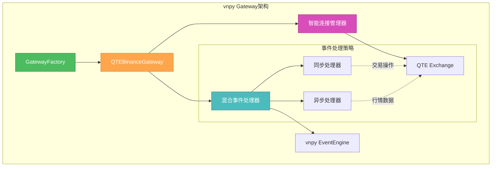

# 🎨🎨🎨 ENTERING CREATIVE PHASE: Gateway架构设计

**组件**: vnpy Gateway架构设计  
**复杂度**: Level 3 (架构决策)  
**状态**: 🎨 Creative Phase进行中  
**目标**: 设计最优的Gateway架构模式

## 📋 组件描述与要求

### 核心功能要求
QTE vnpy Gateway需要实现以下核心功能：
- **vnpy兼容性**: 完全符合vnpy.gateway.BaseGateway接口
- **QTE集成**: 与QTE Exchange无缝连接
- **事件处理**: 高效的事件监听和转发
- **配置管理**: 灵活的配置参数处理
- **错误处理**: 健壮的异常处理机制

### 技术约束
- **性能要求**: 行情推送延迟 < 100ms
- **可靠性**: 24/7连续运行稳定性
- **扩展性**: 支持多品种、多策略
- **维护性**: 代码结构清晰，易于调试

## 🏗️ 架构选项分析

### 1. Gateway核心架构模式

#### 选项1.1: 单例模式 (Singleton Pattern)
```python
class QTEBinanceGateway(BaseGateway):
    _instance = None
    _lock = threading.Lock()
    
    def __new__(cls, event_engine, gateway_name):
        if not cls._instance:
            with cls._lock:
                if not cls._instance:
                    cls._instance = super().__new__(cls)
        return cls._instance
```

**优势**:
- ✅ 保证系统中只有一个Gateway实例
- ✅ 避免多实例导致的资源冲突
- ✅ 状态管理简单，全局唯一
- ✅ 内存占用低

**劣势**:
- ❌ 不利于单元测试（状态共享）
- ❌ 多线程环境下需要额外同步
- ❌ 违反依赖注入原则
- ❌ 难以支持多个交易所连接

**技术适配度**: 🟡 中等  
**复杂度**: 🟢 低  
**扩展性**: 🔴 差

#### 选项1.2: 工厂模式 (Factory Pattern)
```python
class GatewayFactory:
    @staticmethod
    def create_gateway(gateway_type: str, event_engine, **kwargs):
        if gateway_type == "QTE_BINANCE":
            return QTEBinanceGateway(event_engine, **kwargs)
        # 支持未来扩展其他Gateway类型
        
class QTEBinanceGateway(BaseGateway):
    def __init__(self, event_engine, gateway_name="QTE"):
        super().__init__(event_engine, gateway_name)
        # 实例化逻辑
```

**优势**:
- ✅ 支持多种Gateway类型
- ✅ 便于单元测试和依赖注入
- ✅ 符合开闭原则，易于扩展
- ✅ 实例管理灵活

**劣势**:
- ❌ 代码复杂度稍高
- ❌ 需要额外的工厂类维护
- ❌ 可能存在实例过多的问题

**技术适配度**: 🟢 高  
**复杂度**: 🟡 中等  
**扩展性**: 🟢 优秀

#### 选项1.3: 依赖注入模式 (Dependency Injection)
```python
class QTEBinanceGateway(BaseGateway):
    def __init__(self, event_engine, qte_client, config_manager, logger):
        super().__init__(event_engine, "QTE")
        self.qte_client = qte_client
        self.config_manager = config_manager
        self.logger = logger

# 使用依赖注入容器
container = DIContainer()
container.register(QTEClient, QTEClient)
container.register(ConfigManager, ConfigManager)
gateway = container.resolve(QTEBinanceGateway)
```

**优势**:
- ✅ 高度可测试性
- ✅ 松耦合设计
- ✅ 配置灵活
- ✅ 易于Mock和测试

**劣势**:
- ❌ 学习曲线陡峭
- ❌ 引入额外复杂性
- ❌ vnpy生态系统不常用此模式
- ❌ 过度设计的风险

**技术适配度**: 🟡 中等  
**复杂度**: 🔴 高  
**扩展性**: 🟢 优秀

### 2. 事件处理模式

#### 选项2.1: 同步事件处理
```python
class QTEBinanceGateway(BaseGateway):
    def on_qte_event(self, qte_event):
        # 同步处理QTE事件
        vnpy_event = self.convert_event(qte_event)
        self.event_engine.put(vnpy_event)
        
    def send_order(self, req: OrderRequest):
        # 同步发送订单
        result = self.qte_client.send_order(req)
        return result
```

**优势**:
- ✅ 逻辑简单直观
- ✅ 调试容易
- ✅ 错误处理直接
- ✅ 数据一致性好

**劣势**:
- ❌ 可能阻塞主线程
- ❌ 高频数据处理性能差
- ❌ 不适合大量并发操作
- ❌ 用户体验可能受影响

**性能**: 🟡 中等  
**复杂度**: 🟢 低  
**响应性**: 🔴 差

#### 选项2.2: 异步事件处理
```python
class QTEBinanceGateway(BaseGateway):
    def __init__(self, event_engine, gateway_name):
        super().__init__(event_engine, gateway_name)
        self.event_queue = asyncio.Queue()
        self.event_loop = asyncio.new_event_loop()
        
    async def on_qte_event(self, qte_event):
        # 异步处理QTE事件
        vnpy_event = await self.convert_event_async(qte_event)
        await self.event_queue.put(vnpy_event)
        
    async def send_order_async(self, req: OrderRequest):
        # 异步发送订单
        result = await self.qte_client.send_order_async(req)
        return result
```

**优势**:
- ✅ 高性能，适合高频交易
- ✅ 非阻塞，响应性好
- ✅ 支持大量并发操作
- ✅ 资源利用率高

**劣势**:
- ❌ 代码复杂度高
- ❌ 调试困难
- ❌ 异步编程学习曲线
- ❌ 错误处理复杂

**性能**: 🟢 优秀  
**复杂度**: 🔴 高  
**响应性**: 🟢 优秀

#### 选项2.3: 混合事件处理
```python
class QTEBinanceGateway(BaseGateway):
    def __init__(self, event_engine, gateway_name):
        super().__init__(event_engine, gateway_name)
        self.sync_operations = {"send_order", "query_account"}
        self.async_operations = {"market_data", "order_updates"}
        
    def handle_event(self, event_type, data):
        if event_type in self.async_operations:
            asyncio.create_task(self.handle_async(event_type, data))
        else:
            self.handle_sync(event_type, data)
```

**优势**:
- ✅ 平衡性能和复杂度
- ✅ 关键操作保持同步
- ✅ 高频数据异步处理
- ✅ 灵活性高

**劣势**:
- ❌ 设计复杂
- ❌ 需要仔细划分操作类型
- ❌ 维护成本较高
- ❌ 潜在的一致性问题

**性能**: 🟢 优秀  
**复杂度**: 🟡 中等  
**响应性**: 🟢 优秀

### 3. 连接管理策略

#### 选项3.1: 单连接模式
```python
class QTEBinanceGateway(BaseGateway):
    def __init__(self, event_engine, gateway_name):
        super().__init__(event_engine, gateway_name)
        self.qte_connection = None
        
    def connect(self, setting: dict):
        self.qte_connection = QTEConnection(
            host=setting["host"],
            port=setting["port"]
        )
        self.qte_connection.connect()
```

**优势**:
- ✅ 简单直接
- ✅ 资源占用少
- ✅ 状态管理简单
- ✅ 调试容易

**劣势**:
- ❌ 单点故障风险
- ❌ 性能瓶颈
- ❌ 不支持并发操作
- ❌ 扩展性差

**可靠性**: 🔴 差  
**性能**: 🔴 差  
**复杂度**: 🟢 低

#### 选项3.2: 连接池模式
```python
class ConnectionPool:
    def __init__(self, min_size=2, max_size=10):
        self.min_size = min_size
        self.max_size = max_size
        self.connections = []
        self.available = queue.Queue()
        
    def get_connection(self):
        if not self.available.empty():
            return self.available.get()
        if len(self.connections) < self.max_size:
            conn = self.create_connection()
            self.connections.append(conn)
            return conn
        # 等待可用连接
        return self.available.get(timeout=5)

class QTEBinanceGateway(BaseGateway):
    def __init__(self, event_engine, gateway_name):
        super().__init__(event_engine, gateway_name)
        self.connection_pool = ConnectionPool()
```

**优势**:
- ✅ 高并发性能
- ✅ 故障隔离
- ✅ 资源复用
- ✅ 负载分散

**劣势**:
- ❌ 实现复杂
- ❌ 资源管理开销
- ❌ 连接状态同步问题
- ❌ 调试困难

**可靠性**: 🟢 优秀  
**性能**: 🟢 优秀  
**复杂度**: 🔴 高

#### 选项3.3: 智能重连模式
```python
class SmartConnection:
    def __init__(self, config):
        self.config = config
        self.retry_count = 0
        self.max_retries = 5
        self.backoff_factor = 2
        
    def connect_with_retry(self):
        while self.retry_count < self.max_retries:
            try:
                self.connection = self.create_connection()
                self.retry_count = 0  # 重置计数
                return True
            except Exception as e:
                self.retry_count += 1
                wait_time = self.backoff_factor ** self.retry_count
                time.sleep(wait_time)
        return False

class QTEBinanceGateway(BaseGateway):
    def __init__(self, event_engine, gateway_name):
        super().__init__(event_engine, gateway_name)
        self.smart_connection = SmartConnection(self.config)
```

**优势**:
- ✅ 自动故障恢复
- ✅ 网络中断容忍
- ✅ 指数退避策略
- ✅ 生产环境友好

**劣势**:
- ❌ 状态管理复杂
- ❌ 重连期间数据丢失
- ❌ 配置参数较多
- ❌ 可能的无限重试

**可靠性**: 🟢 优秀  
**性能**: 🟡 中等  
**复杂度**: 🟡 中等

## 🎯 推荐架构决策

### 1. Gateway架构模式：工厂模式 (选项1.2)

**决策理由**:
1. **vnpy生态适配**: 工厂模式在vnpy中广泛使用，符合社区惯例
2. **测试友好**: 支持依赖注入，便于单元测试
3. **扩展性**: 未来可以轻松支持多种Gateway类型
4. **维护性**: 代码结构清晰，职责分离

**实现指导**:
```python
# gateway_factory.py
class QTEGatewayFactory:
    @staticmethod
    def create_binance_gateway(event_engine, gateway_name="QTE_BINANCE"):
        return QTEBinanceGateway(event_engine, gateway_name)

# qte_binance_gateway.py  
class QTEBinanceGateway(BaseGateway):
    gateway_name = "QTE_BINANCE"
    
    def __init__(self, event_engine, gateway_name):
        super().__init__(event_engine, gateway_name)
        self.qte_client = None
        self.active = False
```

### 2. 事件处理模式：混合事件处理 (选项2.3)

**决策理由**:
1. **性能平衡**: 关键操作同步，高频数据异步
2. **复杂度可控**: 比纯异步简单，比纯同步高效
3. **用户体验**: 交易操作响应快，行情推送不阻塞
4. **vnpy兼容**: 符合vnpy的事件处理模式

**实现指导**:
```python
class QTEBinanceGateway(BaseGateway):
    def __init__(self, event_engine, gateway_name):
        super().__init__(event_engine, gateway_name)
        # 定义操作类型
        self.sync_operations = {
            "send_order", "cancel_order", "query_account", 
            "query_position", "connect", "disconnect"
        }
        self.async_operations = {
            "market_data", "order_update", "trade_update"
        }
        
    def handle_qte_event(self, event_type, data):
        if event_type in self.async_operations:
            # 异步处理高频数据
            asyncio.create_task(self._handle_async_event(event_type, data))
        else:
            # 同步处理关键操作
            self._handle_sync_event(event_type, data)
```

### 3. 连接管理策略：智能重连模式 (选项3.3)

**决策理由**:
1. **生产可靠性**: 自动处理网络中断
2. **运维友好**: 减少人工干预需求
3. **复杂度适中**: 比连接池简单，比单连接可靠
4. **QTE适配**: 适合QTE虚拟交易所的连接特性

**实现指导**:
```python
class QTEConnectionManager:
    def __init__(self, gateway):
        self.gateway = gateway
        self.connection = None
        self.retry_config = {
            "max_retries": 5,
            "backoff_factor": 2,
            "max_wait": 60
        }
        
    def connect_with_retry(self, setting):
        for attempt in range(self.retry_config["max_retries"]):
            try:
                self.connection = self._create_connection(setting)
                return True
            except Exception as e:
                wait_time = min(
                    self.retry_config["backoff_factor"] ** attempt,
                    self.retry_config["max_wait"]
                )
                time.sleep(wait_time)
        return False
```

## 📐 架构设计图



## ✅ 架构验证清单

### 功能要求验证
- [x] **vnpy兼容性**: 工厂模式符合vnpy标准
- [x] **QTE集成**: 智能连接管理器确保稳定连接
- [x] **事件处理**: 混合模式平衡性能和复杂度
- [x] **配置管理**: 工厂模式支持灵活配置
- [x] **错误处理**: 智能重连提供故障恢复

### 技术约束验证
- [x] **性能要求**: 异步行情处理满足<100ms延迟
- [x] **可靠性**: 智能重连确保24/7稳定运行
- [x] **扩展性**: 工厂模式支持多品种、多策略
- [x] **维护性**: 清晰的职责分离，便于调试

## 🚀 实施优先级

1. **Phase 1**: 实现工厂模式的Gateway基础框架
2. **Phase 2**: 添加智能连接管理器
3. **Phase 3**: 实现混合事件处理机制
4. **Phase 4**: 集成测试和性能优化

---

# 🎨🎨🎨 EXITING CREATIVE PHASE: Gateway架构设计完成

**决策总结**:
- ✅ **架构模式**: 工厂模式 (平衡灵活性和复杂度)
- ✅ **事件处理**: 混合模式 (关键操作同步，行情异步)  
- ✅ **连接管理**: 智能重连 (生产级可靠性)

**下一步**: 进入事件转换机制设计的Creative Phase 