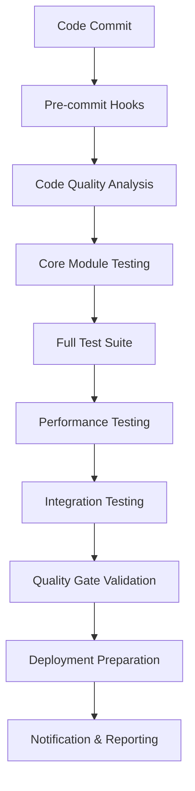

# QTE Continuous Integration & Deployment Setup

## 🚀 Overview

This document describes the comprehensive CI/CD pipeline for the QTE (Quantitative Trading Engine) project, designed to maintain the exceptional quality standards achieved through our TDD implementation (93.7% average coverage, 100% module compliance).

## 📋 Pipeline Architecture

### Pipeline Stages



### Quality Gates

| Gate | Threshold | Purpose |
|------|-----------|---------|
| **Overall Coverage** | ≥90.0% | Maintain high test coverage |
| **Core Modules Coverage** | ≥93.0% | Ensure critical components are well-tested |
| **Test Success Rate** | 100% | All tests must pass |
| **Performance Benchmarks** | Within limits | Prevent performance regressions |
| **Security Scan** | Zero issues | Maintain security standards |
| **Code Quality** | Zero violations | Enforce coding standards |

## 🔧 Setup Instructions

### 1. GitHub Actions Configuration

The main CI/CD pipeline is defined in `.github/workflows/qte-ci-pipeline.yml`:

```yaml
# Key features:
- Multi-Python version testing (3.10, 3.11, 3.12)
- Parallel job execution for efficiency
- Comprehensive quality checks
- Performance benchmarking
- Automated deployment preparation
```

### 2. Pre-commit Hooks Setup

Install and configure pre-commit hooks:

```bash
# Install pre-commit
pip install pre-commit

# Install hooks
pre-commit install

# Install pre-push hooks
pre-commit install --hook-type pre-push

# Run hooks manually
pre-commit run --all-files
```

### 3. Local Development Workflow

```bash
# 1. Make changes
git add .

# 2. Pre-commit hooks run automatically
# - Code formatting (Black)
# - Import sorting (isort)
# - Linting (flake8)
# - Type checking (mypy)
# - Security scanning (bandit)

# 3. Commit changes
git commit -m "Your commit message"

# 4. Pre-push hooks run (optional)
# - Test coverage check
# - Performance regression check
# - Quality gate validation

# 5. Push to trigger CI/CD
git push origin feature-branch
```

## 📊 Quality Metrics & Monitoring

### Coverage Requirements

```python
# Core modules must maintain ≥93% coverage:
CORE_MODULES = [
    'qte.core.time_manager',      # Target: 98.5%
    'qte.core.engine_manager',    # Target: 91.3%
    'qte.core.event_engine',      # Target: 95.6%
    'qte.exchanges.virtual_exchange',  # Target: 97.2%
    'qte.portfolio.base_portfolio',    # Target: 95.2%
    'qte.data.order_book',        # Target: 97.3%
    'qte.strategies.simple_moving_average_strategy',  # Target: 100.0%
    'qte.data.csv_data_provider', # Target: 94.7%
    'qte.backtesting.backtester', # Target: 92.3%
    'qte.exchanges.mock_exchange' # Target: 87.9%
]
```

### Performance Benchmarks

```python
# Performance thresholds enforced by CI:
PERFORMANCE_THRESHOLDS = {
    "engine_startup_max": "0.5s",
    "event_throughput_min": "5000 events/sec",
    "concurrent_throughput_min": "3000 events/sec",
    "memory_leak_max": "100MB",
    "system_throughput_min": "200 events/sec"
}
```

## 🛠️ Tools & Technologies

### Code Quality Tools

- **Black**: Code formatting
- **isort**: Import sorting
- **flake8**: Linting and style checking
- **mypy**: Static type checking
- **bandit**: Security vulnerability scanning
- **pydocstyle**: Documentation style checking

### Testing Tools

- **pytest**: Test framework
- **pytest-cov**: Coverage reporting
- **pytest-benchmark**: Performance benchmarking
- **pytest-xdist**: Parallel test execution
- **pytest-timeout**: Test timeout handling

### CI/CD Tools

- **GitHub Actions**: CI/CD platform
- **codecov**: Coverage reporting
- **pre-commit**: Git hooks
- **safety**: Dependency vulnerability checking

## 📈 Monitoring & Reporting

### Automated Reports

1. **Coverage Reports**: Generated for each build
2. **Performance Benchmarks**: Tracked over time
3. **Security Scans**: Vulnerability assessments
4. **Quality Metrics**: Code quality trends

### Notification System

```yaml
# Build notifications include:
- Overall build status
- Quality gate results
- Coverage changes
- Performance regressions
- Security issues
```

## 🚨 Troubleshooting

### Common Issues

#### Coverage Below Threshold
```bash
# Check coverage locally
pytest tests/unit/core/ --cov=qte.core --cov-report=html
open htmlcov/index.html

# Add missing tests
# Update coverage thresholds if justified
```

#### Performance Regression
```bash
# Run performance tests locally
pytest tests/performance/ --benchmark-only

# Profile slow functions
python -m cProfile -o profile.stats your_script.py

# Analyze results
python -c "import pstats; pstats.Stats('profile.stats').sort_stats('cumulative').print_stats(10)"
```

#### Pre-commit Hook Failures
```bash
# Fix formatting issues
black qte/ tests/
isort qte/ tests/

# Fix linting issues
flake8 qte/ tests/ --show-source

# Fix type issues
mypy qte/ --show-error-codes
```

### Quality Gate Failures

#### Coverage Gate
- Add tests for uncovered code
- Review if coverage threshold is appropriate
- Check for test execution issues

#### Performance Gate
- Profile performance bottlenecks
- Optimize critical code paths
- Update performance thresholds if hardware changed

#### Security Gate
- Review and fix security vulnerabilities
- Update dependencies
- Add security exceptions if false positives

## 🔄 Maintenance

### Regular Tasks

#### Weekly
- Review CI/CD performance metrics
- Update dependency versions
- Check for security updates

#### Monthly
- Review and update performance thresholds
- Analyze coverage trends
- Update documentation

#### Quarterly
- Review and optimize CI/CD pipeline
- Update tool versions
- Conduct security audit

### Pipeline Optimization

```yaml
# Optimization strategies:
- Use caching for dependencies
- Parallelize independent jobs
- Optimize test execution order
- Use matrix builds efficiently
```

## 📚 Best Practices

### Development Workflow

1. **Feature Development**
   - Create feature branch
   - Write tests first (TDD)
   - Implement functionality
   - Ensure all quality gates pass

2. **Code Review**
   - Automated checks must pass
   - Manual review for logic and design
   - Performance impact assessment
   - Security considerations

3. **Deployment**
   - All quality gates passed
   - Performance benchmarks met
   - Security scan clean
   - Documentation updated

### Quality Maintenance

1. **Test Coverage**
   - Maintain ≥90% overall coverage
   - Core modules ≥93% coverage
   - Add tests for new features
   - Remove tests for deprecated code

2. **Performance**
   - Monitor performance trends
   - Set realistic thresholds
   - Profile before optimizing
   - Document performance requirements

3. **Security**
   - Regular dependency updates
   - Automated vulnerability scanning
   - Security-focused code reviews
   - Incident response procedures

## 🎯 Success Metrics

### Key Performance Indicators

- **Build Success Rate**: >95%
- **Average Build Time**: <10 minutes
- **Test Coverage**: ≥93.7%
- **Performance Regression Rate**: <1%
- **Security Vulnerability Count**: 0
- **Code Quality Score**: >95/100

### Quality Trends

Track these metrics over time:
- Test coverage percentage
- Build duration
- Test execution time
- Performance benchmark results
- Security scan results
- Code quality scores

---

**Note**: This CI/CD setup is designed to maintain the exceptional quality standards achieved in the QTE TDD implementation. Regular monitoring and maintenance ensure continued excellence in software delivery.
