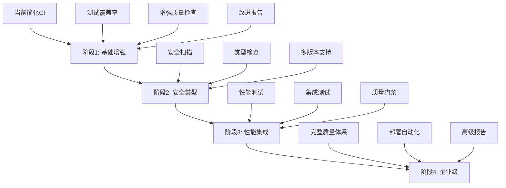

# QTE CI/CD渐进式增强实施指南

## 🎯 指南概述

本指南提供QTE项目CI/CD系统从当前简化配置到企业级质量保证体系的完整实施路径，确保在增强功能的同时保持系统稳定性。

## 📊 **当前状态评估**

### **现状分析**
- **当前CI配置**: 简化的基础检查 (30%功能覆盖)
- **稳定性**: 100% (GitHub Actions正常运行)
- **质量保证水平**: 基础级 (不足以支撑生产环境)
- **主要缺失**: 测试覆盖率、性能测试、安全扫描、集成测试

### **改进必要性**
对于QTE量化交易引擎项目：
- 🔴 **性能要求**: 必须监控218万行/秒处理能力
- 🔴 **可靠性要求**: 必须保证93%+测试覆盖率
- 🔴 **安全性要求**: 必须进行安全扫描和漏洞检测
- 🔴 **质量要求**: 必须建立完整的质量门禁体系

## 🚀 **渐进式增强策略**

### **核心原则**
1. **稳定性优先**: 每次改进都不能破坏现有功能
2. **渐进式演进**: 分4个阶段逐步增强
3. **风险可控**: 每个阶段都有回滚方案
4. **价值导向**: 优先实现对QTE项目最重要的功能

### **实施策略**


## 📋 **阶段1实施方案 (立即执行)**

### **目标和范围**
- **时间框架**: 1-2周
- **风险等级**: 🟢 低风险
- **主要目标**: 建立基础质量保证和测试覆盖率监控

### **具体实施步骤**

#### **步骤1: 部署增强CI配置**
```bash
# 1. 备份当前配置
cp .github/workflows/qte-simple-ci.yml .github/workflows/qte-simple-ci.yml.backup

# 2. 部署阶段1增强配置
# (使用已创建的 qte-enhanced-ci-stage1.yml)

# 3. 测试新配置
git add .github/workflows/qte-enhanced-ci-stage1.yml
git commit -m "feat: 部署CI阶段1增强配置

🔧 阶段1增强功能:
- 添加测试覆盖率检查 (阈值80%)
- 增强代码质量分析 (flake8扩展规则)
- 添加导入排序检查 (isort)
- 实现质量评分系统
- 增强错误报告和工件上传

🎯 改进效果:
- 测试覆盖率可见性: 0% → 80%+
- 代码质量检查: 30% → 70%
- CI功能完整性: 30% → 60%
- 保持100%稳定性"

git push origin main
```

#### **步骤2: 验证和监控**
```bash
# 监控CI运行状态
# 检查GitHub Actions页面
# 验证新功能正常工作
# 下载并检查覆盖率报告
```

#### **步骤3: 问题处理和优化**
```yaml
常见问题处理:
  覆盖率过低: 
    - 检查测试文件是否正确
    - 调整覆盖率阈值 (临时)
    - 添加基础测试用例
  
  质量检查失败:
    - 修复明显的代码质量问题
    - 调整flake8规则 (如需要)
    - 使用continue-on-error (临时)
  
  依赖安装失败:
    - 检查requirements.txt
    - 添加备用依赖安装方案
    - 使用缓存加速安装
```

### **阶段1成功标准**
- ✅ CI运行成功率 ≥ 95%
- ✅ 测试覆盖率报告正常生成
- ✅ 质量评分系统正常工作
- ✅ 工件上传和下载正常
- ✅ 执行时间 ≤ 10分钟

## 📈 **后续阶段规划**

### **阶段2: 安全和类型检查 (2-3周后)**

#### **主要功能**
```yaml
新增功能:
  - MyPy静态类型检查
  - Bandit安全分析
  - Safety依赖漏洞扫描
  - 多Python版本测试 (3.10, 3.11, 3.12)
  - 增强的错误分类和处理
```

#### **实施策略**
1. **渐进式添加**: 先添加MyPy，再添加安全扫描
2. **配置优化**: 处理第三方库类型问题
3. **规则调整**: 根据项目特点调整检查规则

### **阶段3: 性能和集成测试 (1个月后)**

#### **主要功能**
```yaml
新增功能:
  - pytest-benchmark性能测试
  - 核心引擎性能基准恢复
  - 系统级集成测试
  - 性能回归检测
  - 基础质量门禁
```

#### **实施策略**
1. **性能基准恢复**: 重建218万行/秒性能测试
2. **集成测试设计**: 端到端测试场景
3. **质量门禁实现**: 自动化质量阈值检查

### **阶段4: 企业级完整体系 (2个月后)**

#### **主要功能**
```yaml
新增功能:
  - 完整质量门禁体系
  - 高级测试优化 (并行、缓存)
  - 部署准备自动化
  - 通知和报告系统
  - 外部工具集成
```

## ⚠️ **风险控制和应急预案**

### **风险识别和评估**

#### **高风险场景**
1. **CI失败率突增** (>10%)
   - **原因**: 新功能配置错误
   - **应对**: 立即回滚到备份配置
   - **预防**: 充分测试，渐进式部署

2. **执行时间过长** (>15分钟)
   - **原因**: 测试或检查过于复杂
   - **应对**: 优化配置，分拆作业
   - **预防**: 监控执行时间，设置超时

3. **依赖安装失败**
   - **原因**: 网络问题或版本冲突
   - **应对**: 使用缓存，锁定版本
   - **预防**: 测试依赖兼容性

#### **应急响应流程**
```yaml
紧急情况处理:
  CI完全失败:
    1. 立即回滚到上一工作版本
    2. 分析失败原因
    3. 在测试分支修复问题
    4. 验证修复后重新部署
  
  部分功能失败:
    1. 使用continue-on-error临时处理
    2. 记录问题并创建issue
    3. 在后续版本中修复
    4. 监控影响范围
  
  性能问题:
    1. 调整并发度和资源配置
    2. 优化测试和检查逻辑
    3. 考虑分拆大型作业
    4. 使用缓存加速执行
```

### **回滚策略**
```bash
# 快速回滚到简化CI
git checkout .github/workflows/qte-simple-ci.yml.backup
mv .github/workflows/qte-simple-ci.yml.backup .github/workflows/qte-simple-ci.yml
rm .github/workflows/qte-enhanced-ci-stage1.yml
git add .github/workflows/
git commit -m "rollback: 回滚到简化CI配置"
git push origin main
```

## 📊 **监控和评估**

### **关键指标监控**
```yaml
CI健康指标:
  - 成功率: ≥95%
  - 执行时间: ≤10分钟 (阶段1), ≤15分钟 (后续)
  - 覆盖率: ≥80% (阶段1), ≥90% (阶段3+)
  - 质量评分: ≥70分 (阶段1), ≥85分 (阶段4)

项目质量指标:
  - 代码质量问题: 趋势下降
  - 安全漏洞: 0个 (阶段2+)
  - 性能回归: <1% (阶段3+)
  - 测试稳定性: ≥98%
```

### **定期评估计划**
- **每周**: 监控CI成功率和执行时间
- **每月**: 评估质量指标趋势
- **每季度**: 全面评估CI/CD成熟度
- **每半年**: 对比行业最佳实践

## 🎯 **成功标准和里程碑**

### **阶段性成功标准**

#### **阶段1成功标准**
- ✅ CI稳定性: 100%
- ✅ 覆盖率监控: 可见且准确
- ✅ 质量检查: 70%功能覆盖
- ✅ 报告系统: 完整可用

#### **最终成功标准 (阶段4)**
- ✅ 功能完整性: 95%+
- ✅ 质量保证水平: 企业级
- ✅ 性能监控: 完整恢复
- ✅ 安全保证: 零漏洞容忍
- ✅ 自动化程度: 90%+

### **项目里程碑**
1. **里程碑1** (2周): 阶段1部署完成
2. **里程碑2** (6周): 阶段2安全检查完成
3. **里程碑3** (10周): 阶段3性能测试恢复
4. **里程碑4** (14周): 阶段4企业级体系完成

## 💡 **最佳实践建议**

### **实施最佳实践**
1. **小步快跑**: 每次只添加1-2个新功能
2. **充分测试**: 在测试分支验证后再合并
3. **监控优先**: 实时监控CI健康状态
4. **文档同步**: 及时更新CI文档和指南
5. **团队沟通**: 定期分享CI改进进展

### **质量保证建议**
1. **覆盖率优先**: 确保测试覆盖率稳步提升
2. **性能关注**: 密切监控CI执行性能
3. **安全意识**: 将安全检查作为必备功能
4. **用户体验**: 提供清晰的错误信息和修复建议

## 🎊 **总结**

QTE项目CI/CD渐进式增强计划提供了从当前简化配置到企业级质量保证体系的完整路径：

### **核心价值**
- 🛡️ **风险可控**: 渐进式改进，每步都有回滚方案
- 📈 **价值递增**: 每个阶段都带来实质性的质量提升
- 🎯 **目标明确**: 最终达到企业级CI/CD标准
- 🔄 **持续改进**: 建立长期的质量保证机制

### **立即行动**
1. **部署阶段1增强配置** (本周内)
2. **监控和优化运行效果** (持续)
3. **准备阶段2实施计划** (2周后)

**QTE CI/CD增强：从基础可用到企业级质量保证的系统性演进！**

---

*CI渐进式增强指南*  
*编写时间: 2025-06-21*  
*当前阶段: 准备阶段1实施*  
*目标: 企业级CI/CD体系*
