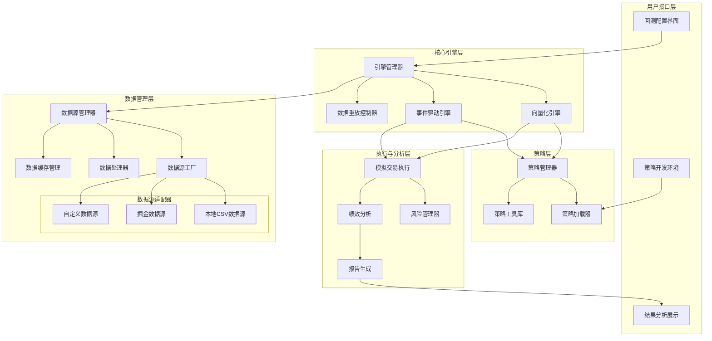

# 量化回测引擎架构优化方案

## 一、架构优化背景

随着项目的发展，特别是多数据源接入需求的增加，当前架构需要进行优化，以支持更灵活、高效的数据源管理和回测流程。经研究多个成熟的量化回测框架（如Backtrader等），我们发现可以采纳多种设计模式来改进当前系统。

## 二、现有架构评估

### 优点：
1. 双引擎设计（向量化和事件驱动）灵活且高效
2. 基本数据源抽象已实现
3. 策略接口设计清晰且易于扩展

### 待改进点：
1. 数据源管理缺乏统一的注册与工厂机制
2. 数据重放与转换功能有限
3. 多数据源协同机制不足
4. 回测控制流程需要增强
5. 缓存管理与性能优化空间较大

## 三、架构优化方案



## 四、主要优化点详述

### 1. 数据管理层改进

#### 数据源工厂模式
引入数据源工厂类（`DataSourceFactory`），实现统一的数据源创建接口：

```python
class DataSourceFactory:
    @staticmethod
    def create(source_type, **kwargs):
        """根据类型创建数据源实例"""
        if source_type == 'gm':
            return GmQuantSource(**kwargs)
        elif source_type == 'csv':
            return LocalCsvSource(**kwargs)
        # 可扩展其他数据源
```

#### 数据源注册管理机制
改进数据源管理器，支持动态注册和切换数据源：

```python
class DataSourceManager:
    def register_source(self, name, source, make_default=False):
        """注册数据源"""
        
    def get_source(self, name=None):
        """获取指定数据源实例"""
        
    def set_default_source(self, name):
        """设置默认数据源"""
```

#### 数据处理与转换层
新增数据处理器模块，提供数据重采样、对齐等功能：

```python
class DataProcessor:
    @staticmethod
    def resample(data, source_freq, target_freq):
        """重采样数据到目标频率"""
        
    @staticmethod
    def align_multiple_sources(data_dict):
        """对齐多个数据源的时间索引"""
```

#### 分层缓存管理
实现内存和磁盘双层缓存策略，优化数据获取性能：

```python
class DataCache:
    def get(self, key):
        """优先从内存缓存获取，不存在则尝试从磁盘缓存获取"""
        
    def set(self, key, value, expire=None):
        """同时更新内存和磁盘缓存"""
```

### 2. 引擎层改进

#### 数据重放控制
参考Backtrader的replaydata机制，实现灵活的数据重放控制：

```python
class ReplayController:
    def replay(self, data, timeframe, compression, **kwargs):
        """控制数据重放过程"""
        
    def pause(self):
        """暂停重放"""
        
    def resume(self):
        """恢复重放"""
```

#### 引擎管理器增强
增强引擎管理器，支持直接从数据源获取数据并执行回测：

```python
class EngineManager:
    def load_data(self, symbol, start_date, end_date, source_name=None):
        """直接从数据源管理器加载数据"""
        
    def run_with_data_source(self, symbols, start_date, end_date, source_name=None):
        """直接使用数据源运行回测，无需预先加载数据"""
```

### 3. 策略层改进

#### 多数据源协作
改进策略接口，支持处理多个数据源：

```python
class Strategy:
    def generate_signals(self, data_dict):
        """处理多个数据源的策略实现"""
```

#### 策略参数管理
增强策略参数管理，支持参数的保存、加载和版本控制：

```python
class StrategyParameters:
    def save(self, filename):
        """保存参数到文件"""
        
    def load(self, filename):
        """从文件加载参数"""
        
    def version_control(self):
        """参数版本控制"""
```

### 4. 分析层改进

#### 回测结果格式统一
统一向量化引擎和事件驱动引擎的回测结果格式，便于比较和分析：

```python
class BacktestResult:
    def __init__(self, metrics, trades, positions, equity_curve):
        """统一的回测结果结构"""
        
    def compare(self, other_result):
        """比较两个回测结果"""
```

#### 绩效指标扩展
增加更多绩效评估指标，参考行业标准：

```python
class PerformanceMetrics:
    def calculate_sharpe_ratio(self):
        """计算夏普比率"""
        
    def calculate_maximum_drawdown(self):
        """计算最大回撤"""
        
    def calculate_win_rate(self):
        """计算胜率"""
```

## 五、实施路径

### 第一阶段：数据源优化（当前）
1. 完善数据源接口设计
2. 实现数据源工厂和注册管理机制
3. 开发核心数据源适配器（LocalCsv、GmQuant）
4. 添加基础数据处理功能

### 第二阶段：引擎联动增强
1. 改进引擎管理器，支持直接数据源集成
2. 实现数据重放控制机制
3. 统一回测结果格式
4. 增强多数据源协作能力

### 第三阶段：策略与分析提升
1. 优化策略接口，支持多数据源
2. 增强策略参数管理
3. 扩展绩效分析指标
4. 改进可视化与报告功能

### 第四阶段：系统集成与优化
1. 性能优化与并行处理
2. 完善缓存管理
3. 系统稳定性与错误处理增强
4. 文档与示例完善

## 六、总结

本次架构优化聚焦于数据源管理和回测流程的改进，借鉴了成熟量化框架的设计理念，将使系统更加灵活、可扩展，并能更好地支持多数据源场景。优化过程将逐步实施，确保系统的稳定性和向后兼容性。 