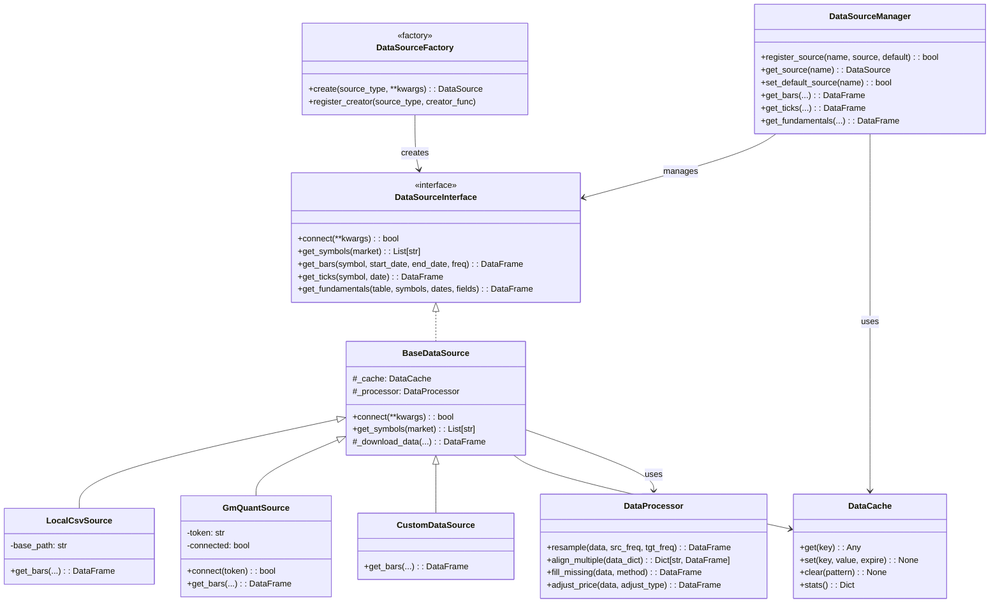

# 量化回测引擎数据源规范

## 一、简介

数据源模块是量化回测引擎的基础组件，负责从各种来源获取、处理和提供交易数据。本规范定义了QTE框架中数据源的接口标准、开发规范和最佳实践，以确保各数据源的一致性和可组合性。

## 二、架构概述



## 三、核心接口规范

### 1. 数据源接口 (DataSourceInterface)

所有数据源必须实现以下核心接口：

```python
class DataSourceInterface:
    def connect(self, **kwargs) -> bool:
        """连接到数据源"""
        pass
        
    def get_symbols(self, market: Optional[str] = None, **kwargs) -> List[str]:
        """获取可用标的列表"""
        pass
        
    def get_bars(self, symbol: str, start_date: Optional[str] = None, 
                end_date: Optional[str] = None, frequency: str = '1d', 
                **kwargs) -> Optional[pd.DataFrame]:
        """获取K线数据"""
        pass
        
    def get_ticks(self, symbol: str, date: str, **kwargs) -> Optional[pd.DataFrame]:
        """获取Tick数据"""
        pass
        
    def get_fundamentals(self, table: str, symbols: List[str], 
                        start_date: Optional[str] = None, 
                        end_date: Optional[str] = None, 
                        fields: Optional[List[str]] = None, **kwargs) -> Optional[pd.DataFrame]:
        """获取基本面数据"""
        pass
```

### 2. 数据格式标准

为确保各个数据源返回的数据格式一致，规定以下标准：

#### K线数据 (Bar Data)
- 必须包含列：`open`, `high`, `low`, `close`, `volume` 
- 索引必须为 `datetime` 类型的时间索引，已排序
- 示例：

```
                     open    high     low   close    volume
datetime                                                   
2022-01-03 00:00:00  10.10   10.25   10.05   10.20  2451000
2022-01-04 00:00:00  10.22   10.35   10.18   10.30  3012000
```

#### Tick数据 (Tick Data)
- 必须包含列：`price`, `volume` (最低要求)
- 推荐包含：`bid_price`, `ask_price`, `bid_volume`, `ask_volume` (如可用)
- 索引必须为 `datetime` 类型的时间索引，精确到毫秒，已排序
- 示例：

```
                               price  volume  bid_price  ask_price  bid_volume  ask_volume
datetime                                                                                 
2022-01-03 09:30:00.000      10.10    1000      10.09      10.11       5000        4000
2022-01-03 09:30:00.500      10.12     500      10.11      10.13       3000        2000
```

#### 基本面数据 (Fundamental Data)
- 必须包含标的代码列和日期列
- 其余列根据具体数据表而定
- 示例：

```
      symbol        date        eps     pe_ratio  market_cap
0  SHSE.600000  2022-01-03     0.45      12.5     50000000
1  SHSE.600000  2022-03-31     0.50      11.8     52000000
```

### 3. 错误处理规范

数据源应遵循以下错误处理标准：

1. **无数据情况**：当无法获取数据时，应返回 `None` 或空 DataFrame，不应抛出异常
2. **连接失败**：`connect()` 方法应返回 `False`，并记录详细错误信息，而不是抛出异常
3. **参数错误**：对于明显的参数错误，应抛出 `ValueError` 异常并提供清晰的错误信息
4. **网络/数据源错误**：应实现重试机制，并在多次失败后返回 `None`
5. **数据格式错误**：应尝试修复或转换格式，如无法修复则返回 `None` 而非错误的数据

### 4. 性能与缓存指南

为优化性能，数据源应遵循以下指南：

1. **实现缓存机制**：频繁访问的数据应使用内存缓存，长期数据应使用磁盘缓存
2. **启用查询优化**：避免重复查询，合并相近时间范围的查询
3. **懒加载策略**：延迟加载大量数据，直到确实需要时才加载
4. **数据压缩**：使用适当的压缩算法减少存储空间和传输时间
5. **异步预加载**：预测并异步加载可能需要的数据

## 四、各模块详细规范

### 1. 数据源工厂 (DataSourceFactory)

数据源工厂负责创建和管理各类数据源的实例化过程：

```python
class DataSourceFactory:
    @staticmethod
    def create(source_type: str, **kwargs) -> DataSourceInterface:
        """根据类型创建数据源实例"""
        pass
        
    @staticmethod
    def register_creator(source_type: str, creator_func: Callable) -> None:
        """注册自定义数据源创建函数"""
        pass
        
    @staticmethod
    def list_available_sources() -> List[str]:
        """列出所有可用的数据源类型"""
        pass
```

### 2. 数据源管理器 (DataSourceManager)

数据源管理器负责管理多个数据源实例，并提供统一的数据访问接口：

```python
class DataSourceManager:
    def register_source(self, name: str, source: DataSourceInterface, 
                       make_default: bool = False) -> bool:
        """注册数据源"""
        pass
        
    def get_source(self, name: Optional[str] = None) -> DataSourceInterface:
        """获取数据源实例"""
        pass
        
    def set_default_source(self, name: str) -> bool:
        """设置默认数据源"""
        pass
        
    def list_sources(self) -> List[str]:
        """列出所有已注册的数据源"""
        pass
        
    # 统一数据访问方法，转发到对应数据源
    def get_bars(self, symbol: str, start_date: Optional[str] = None, 
                end_date: Optional[str] = None, frequency: str = '1d',
                source_name: Optional[str] = None, **kwargs) -> Optional[pd.DataFrame]:
        """获取K线数据，从指定或默认数据源"""
        pass
```

### 3. 数据处理器 (DataProcessor)

数据处理器提供各种数据处理和转换功能：

```python
class DataProcessor:
    @staticmethod
    def resample(data: pd.DataFrame, source_freq: str, 
                target_freq: str, method: str = 'ohlc') -> pd.DataFrame:
        """重采样数据，如从1分钟到5分钟、日线到周线等"""
        pass
        
    @staticmethod
    def align_multiple(data_dict: Dict[str, pd.DataFrame]) -> Dict[str, pd.DataFrame]:
        """对齐多个数据源的时间戳"""
        pass
        
    @staticmethod
    def fill_missing(data: pd.DataFrame, method: str = 'ffill') -> pd.DataFrame:
        """填充缺失值"""
        pass
        
    @staticmethod
    def adjust_price(data: pd.DataFrame, adjust_type: str = 'qfq') -> pd.DataFrame:
        """价格前复权/后复权处理"""
        pass
```

### 4. 数据缓存 (DataCache)

数据缓存负责提高数据获取性能：

```python
class DataCache:
    def get(self, key: str) -> Any:
        """获取缓存数据"""
        pass
        
    def set(self, key: str, value: Any, expire: Optional[int] = None) -> None:
        """设置缓存数据，可选过期时间（秒）"""
        pass
        
    def clear(self, pattern: Optional[str] = None) -> None:
        """清除指定模式的缓存，None表示清除所有缓存"""
        pass
        
    def stats(self) -> Dict[str, Any]:
        """获取缓存统计信息"""
        pass
```

## 五、实现指南

### 1. 基本数据源实现步骤

1. **继承基类**：继承 `BaseDataSource` 或直接实现 `DataSourceInterface`
2. **实现连接方法**：实现 `connect()` 方法，建立与数据源的连接
3. **实现核心数据获取**：至少实现 `get_bars()` 方法，其他方法可选
4. **添加错误处理**：增加适当的重试逻辑和错误处理
5. **添加缓存支持**：使用 `DataCache` 优化性能
6. **单元测试**：编写全面的单元测试用例
7. **在工厂中注册**：通过 `DataSourceFactory.register_creator()` 注册

### 2. 本地CSV数据源示例

```python
class LocalCsvSource(BaseDataSource):
    def __init__(self, base_path: str = "examples/test_data/"):
        super().__init__()
        self.base_path = base_path
        self.project_root = os.path.abspath(os.path.join(os.path.dirname(__file__), '..', '..', '..'))
        self.resolved_base_path = os.path.join(self.project_root, self.base_path)
        
    def connect(self, **kwargs) -> bool:
        """验证路径是否存在"""
        return os.path.exists(self.resolved_base_path)
        
    def get_bars(self, symbol: str, start_date: Optional[str] = None, 
                end_date: Optional[str] = None, frequency: str = '1d', 
                file_name: Optional[str] = None, **kwargs) -> Optional[pd.DataFrame]:
        """从CSV文件加载K线数据"""
        # 实现细节...
```

### 3. 掘金数据源示例

```python
class GmQuantSource(BaseDataSource):
    def __init__(self, token: Optional[str] = None):
        super().__init__()
        self.token = token
        self.connected = False
        
    def connect(self, token: Optional[str] = None, **kwargs) -> bool:
        """连接掘金API"""
        if token:
            self.token = token
            
        if not self.token:
            return False
            
        try:
            from gm.api import set_token
            set_token(self.token)
            self.connected = True
            return True
        except Exception:
            return False
            
    def get_bars(self, symbol: str, start_date: Optional[str] = None, 
                end_date: Optional[str] = None, frequency: str = '1d', 
                adjust: str = 'ADJUST_PREV', **kwargs) -> Optional[pd.DataFrame]:
        """获取K线数据"""
        # 实现细节...
```

## 六、测试规范

### 1. 测试文件组织

测试文件应按以下结构组织：

```
test/
  data_provider/
    test_data_source_factory.py
    test_data_source_manager.py 
    test_data_processor.py
    test_data_cache.py
    sources/
      test_local_csv_source.py
      test_gm_quant_source.py
      # 其他数据源测试
```

### 2. 测试覆盖要求

数据源测试至少需要覆盖以下场景：

1. **基本功能测试**：测试各个方法的正常功能
2. **边界条件测试**：测试空数据、极小数据量、极大数据量的情况
3. **错误处理测试**：测试各种错误情况的恢复能力
4. **性能测试**：测试数据获取性能和缓存效果
5. **集成测试**：测试与其他模块的集成

### 3. 测试辅助数据

每个数据源应提供测试用的样本数据，放置在 `test/data_provider/test_data/` 目录下。

## 七、文档规范

### 1. 文档结构

数据源相关文档应包含：

1. **模块概述**：简要介绍数据源的功能和特点
2. **接口说明**：详细说明各个方法的参数和返回值
3. **使用示例**：提供完整的使用代码示例
4. **配置指南**：说明如何配置和优化数据源
5. **故障排除**：常见问题和解决方案

### 2. 示例代码

每个数据源应提供至少3个示例代码：

1. **基本使用示例**：展示最简单的使用方式
2. **高级特性示例**：展示特定数据源的高级特性
3. **与回测引擎集成示例**：展示如何与回测引擎集成使用

## 八、开发最佳实践

1. **命名规范**：
   - 数据源类名应以 `Source` 结尾，如 `GmQuantSource`
   - 方法名应使用动词前缀，如 `get_bars`、`download_data`

2. **注释规范**：
   - 使用 NumPy 风格的文档字符串
   - 核心方法必须有详细的参数和返回值说明

3. **错误处理**：
   - 使用 `logging` 模块记录错误，而不是 `print`
   - 提供详细的错误消息，包括可能的解决方案

4. **性能考虑**：
   - 避免在循环中重复计算
   - 使用缓存减少重复数据获取
   - 对大型数据操作使用 pandas 矢量化操作，避免循环

5. **代码组织**：
   - 保持每个数据源类在单独的文件中
   - 将共用功能提取到基类或工具函数 