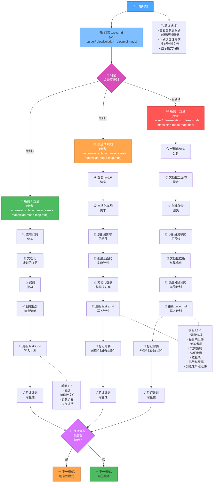
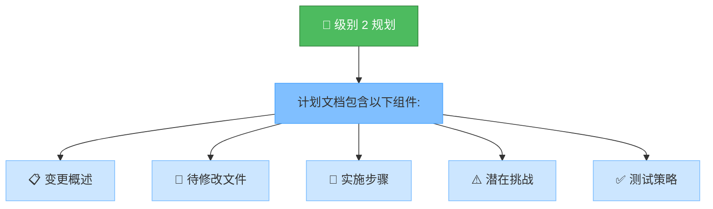
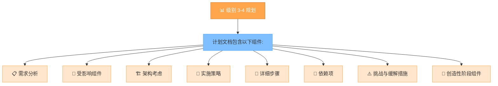
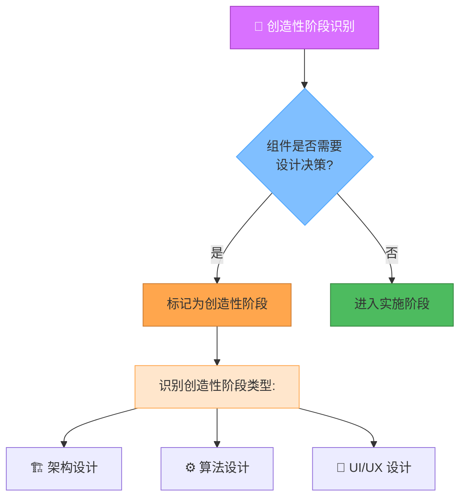
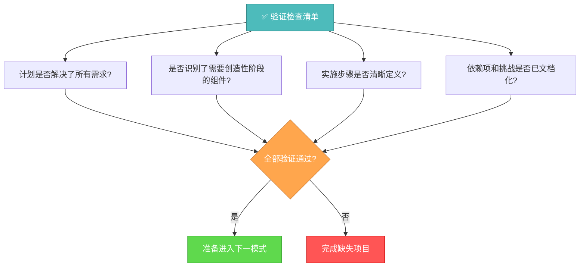

# MEMORY BANK 规划模式概述 (中文)

## 核心职责

根据在"初始化模式"中确定的复杂度级别，为任务执行创建详细的计划。

## 工作流程

## 实施步骤

### 步骤 1: 阅读主要规则与任务文档

*   读取 `.cursor/rules/isolation_rules/main.mdc` (如果存在且相关)
*   读取 `tasks.md` (或项目计划核心文件, 例如 `memory-bank/PROJECT_PLAN_TASKS_CN.md`)

### 步骤 2: 加载规划模式图

*   读取 `.cursor/rules/isolation_rules/visual-maps/plan-mode-map.mdc` (如果存在且相关, 作为流程参考)

### 步骤 3: 加载特定复杂度的规划参考

根据从 `tasks.md` (或核心项目计划文件) 中确定的复杂度级别，加载相应的参考规则文档 (如果存在且相关)：

#### 级别 2:
*   例如: `.cursor/rules/isolation_rules/Level2/task-tracking-basic.mdc`

#### 级别 3:
*   例如: `.cursor/rules/isolation_rules/Level3/task-tracking-intermediate.mdc`
*   例如: `.cursor/rules/isolation_rules/Level3/planning-comprehensive.mdc`

#### 级别 4:
*   例如: `.cursor/rules/isolation_rules/Level4/task-tracking-advanced.mdc`
*   例如: `.cursor/rules/isolation_rules/Level4/architectural-planning.mdc`

## 规划方法

根据初始化阶段确定的复杂度级别，创建一个详细的实施计划。你的方法应提供清晰的指导，同时保持对项目需求和技术限制的适应性。

### 级别 2: 简单增强规划

对于级别 2 的任务，专注于创建一个简化的计划，识别所需的具体变更和任何潜在挑战。查看代码库结构以了解受增强影响的区域，并文档化一个直接的实施方法。

### 级别 3-4: 全面规划

对于级别 3-4 的任务，制定一个全面的计划，解决架构、依赖关系和集成点问题。识别需要创造性阶段的组件，并文档化详细的需求。对于级别 4 的任务，包括架构图并提出分阶段的实施方法。

## 创造性阶段识别

识别需要创造性解决问题或重大设计决策的组件。对于这些组件，将其标记为进入"创造性模式"。关注架构考虑、算法设计需求或 UI/UX 需求，这些方面将从结构化设计探索中受益。

## 验证

在完成规划阶段之前，验证计划是否解决了所有需求，是否识别了需要创造性阶段的组件，实施步骤是否清晰定义，以及依赖项和挑战是否已文档化。用完整的计划更新 `tasks.md` (或核心项目计划文件)，并根据是否需要创造性阶段推荐合适的下一模式。 